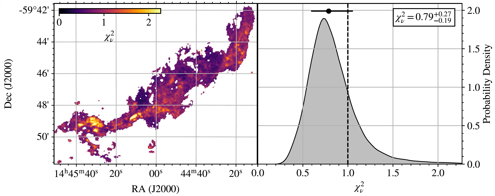

#############################
Tutorial: Exploring Cube Fits
#############################

Having fit our cube, we can pull out a bunch of parameters and have a look at the data. Following the
:doc:`previous tutorial <cube_fitting>`, we have an ``hf_fitter`` object, that contains the maps,
which is a dictionary that we can pull things out of:

.. code-block:: python

    maps = hf_fitter.parameter_maps

    # Get the reduced chi-square
    chisq_red = maps["chisq_red"]

You can then plot this up however you might like:

The fitted parameters (and errors) are also in here as ``[param]_[comp_no]``, ``[param]_[comp_no]_err_up``, and
``[param]_[comp_no]_err_down``. Note these don't take into account the covariances, if you want to properly sample
for the purposes of a plot then you'll need the full set of walkers, which are saved in individual fit dictionary files.

You can also plot things in much the same way as in the :doc:`single spectra plotting <plotting_a_spectrum>` way,
except you can also provide a grid to cut down the number of plots created. For example:

.. code-block:: python

    plot_dir = "plots"

    grid = np.zeros_like(chisq_red)

    grid[10, 10] = 1
    grid[50, 50] = 1

    if not os.path.exists(plot_dir):
        os.makedirs(plot_dir)

    hf_plotter.plot_step(plot_name=os.path.join(fit_dir, plot_dir, f"{target}_step"),
                         fit_dict_filename=os.path.join(coherence_backward_dir, fit_dict_filename),
                         n_comp_filename=os.path.join(coherence_backward_dir, n_comp_filename),
                         grid=grid)
    hf_plotter.plot_corner(plot_name=os.path.join(plot_dir, f"{target}_corner"),
                           fit_dict_filename=os.path.join(coherence_backward_dir, fit_dict_filename),
                           n_comp_filename=os.path.join(coherence_backward_dir, n_comp_filename),
                           grid=grid)
    hf_plotter.plot_fit(plot_name=os.path.join(plot_dir, f"{target}_fit"),
                        fit_dict_filename=os.path.join(coherence_backward_dir, fit_dict_filename),
                        n_comp_filename=os.path.join(coherence_backward_dir, n_comp_filename),
                        grid=grid)

.. image:: images/cube_fit.png
