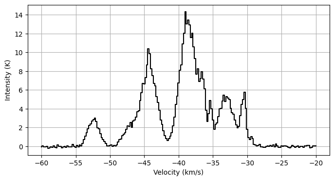

#########################################
Tutorial: Generating a synthetic spectrum
#########################################

Here, we'll generate a synthetic spectrum to later fit. Let's make a 3 component model.
This is how you can generate an N2H+ spectrum (which here is centred around a velocity of -40km/s):

.. code-block:: python

    import matplotlib.pyplot as plt
    from mcfine.fitting import multiple_components
    from mcfine.line_info import v_lines, strength_lines
    import numpy as np

    np.random.seed(42)

    # Generate a velocity grid
    vel_min = -60
    vel_max = -20
    vel_step = 0.2

    vel = np.arange(vel_min, vel_max + vel_step, vel_step)

    # Get the line info out for N2H+
    strength_lines_n2hp = np.array([strength_lines[line_name]
                                    for line_name in strength_lines.keys()
                                    if "n2hp10" in line_name])
    v_lines_n2hp = np.array([v_lines[line_name]
                             for line_name in v_lines.keys()
                             if "n2hp10" in line_name])

    # Randomly draw parameters for each component, between certain bounds. We use
    # log(tau) since we'll end up fitting in log-space
    t_ex_range = [5, 25]
    tau_range = [0.5, 5]
    v_range = [-5, 5]
    sigma_range = [0.25, 1]
    n_comp = 3

    theta = []

    t_ex = np.random.uniform(*t_ex_range, n_comp)
    tau = np.log(np.random.uniform(*tau_range, n_comp))
    v = np.random.uniform(*v_range, n_comp) - 40
    sigma = np.random.uniform(*sigma_range, n_comp)

    # Make sure these things are in velocity order
    idx = np.argsort(v)
    t_ex = t_ex[idx]
    tau = tau[idx]
    v = v[idx]
    sigma = sigma[idx]

    for i in range(n_comp):
        theta.extend([t_ex[i], tau[i], v[i], sigma[i]])

    # Generate noise-free spectrum
    props = [
       "tex",
       "tau",
       "v",
       "sigma",
    ]
    spectrum_noise_free = multiple_components(theta=theta,
                                              vel=vel,
                                              strength_lines=strength_lines_n2hp,
                                              v_lines=v_lines_n2hp,
                                              props=props,
                                              n_comp=n_comp,
                                              )

    # Create an error spectrum with 0.1K random noise and 5% calibration error
    noise_level = 0.1
    error_percent = 0.05
    error = noise_level * np.ones_like(vel)
    error_spectrum = np.sqrt(error ** 2 + (error_percent * spectrum_noise_free) ** 2)

    spectrum_obs = spectrum_noise_free + np.random.normal(loc=0, scale=error_spectrum)

    # Finally, let's plot this spectrum
    plt.figure(figsize=(8, 4))
    plt.step(vel,
             spectrum_obs,
             where="mid",
             c="k",
    )

    plt.grid()

    plt.xlabel("Velocity (km/s)")
    plt.ylabel("Intensity (K)")

