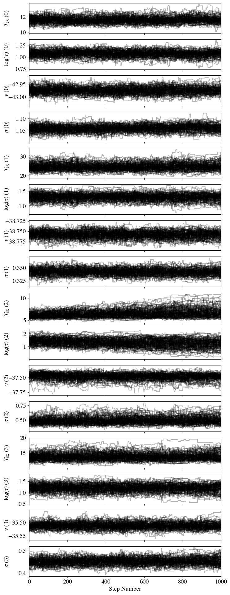
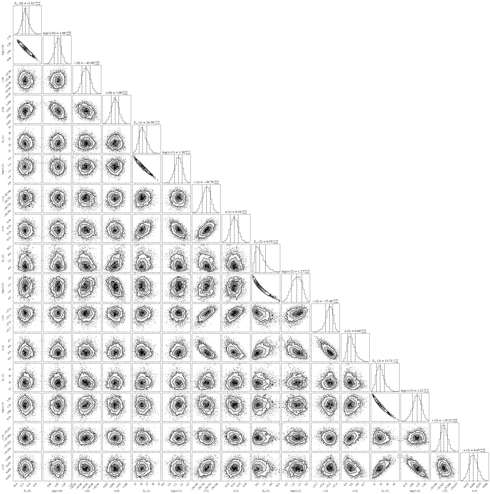
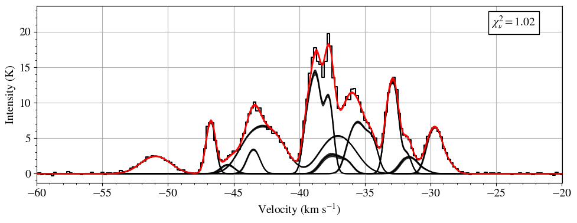

#############################
Tutorial: Plotting a spectrum
#############################

Having fit the spectrum, we can then plot and explore the fits using the ``HyperfinePlotter`` submodule
of ``mcfine``. Assuming we have a fit called something like ``fit_1.pkl``:

.. code-block:: python

        fit_dict_filename = 'fit_1'  # N.B. The .pkl is automatically appended, so you should not have it here

        # Step plot
        plot_name = "fit_1_step"

        if not os.path.exists(f"{plot_name}.png") or overwrite:
            hp.plot_step(fit_dict_filename=fit_dict_filename,
                         plot_name=plot_name,
                         )

This will make the step plot:

We can also make corner plots:

 .. code-block:: python

        # Corner plot
        plot_name = 'fit_1_corner'

        if not os.path.exists(f"{plot_name}.png") or overwrite:
            hp.plot_corner(fit_dict_filename=fit_dict_filename,
                           plot_name=plot_name,
                           )

And probably the most useful, the actual fit to the data:

.. code-block:: python

        # Fit plot
        plot_name = 'fit_1'

        if not os.path.exists(f"{plot_name}.png") or overwrite:
            hp.plot_corner(fit_dict_filename=fit_dict_filename,
                           plot_name=plot_name,
                           )

